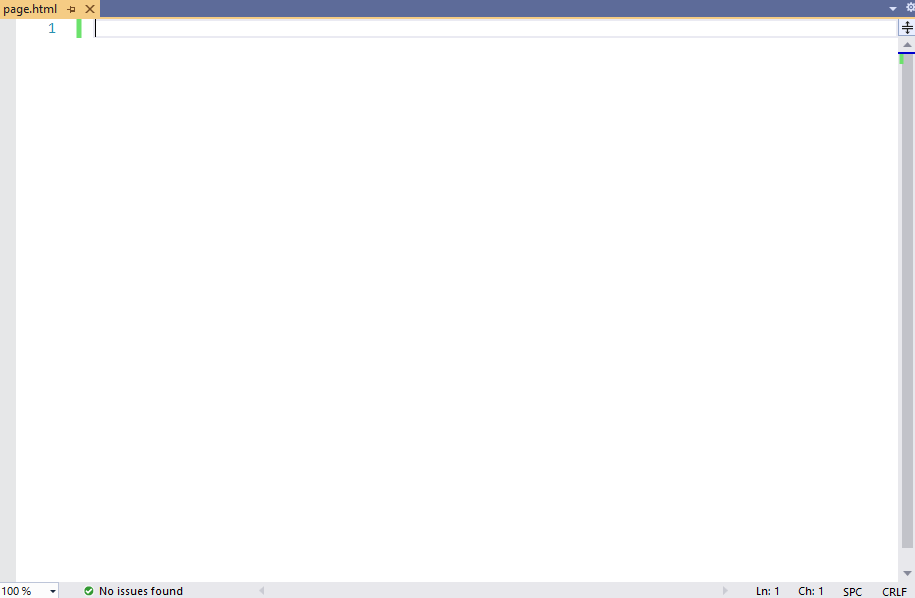

# Bootstrap4vs

This extension covers absolutely all components of Bootstrap 4 with several examples per component, it will allow you to code faster and rather focus on your code. 

[Source code](https://github.com/oufly/Bootstrap4vs) | [Report bug or suggestion](https://github.com/oufly/Bootstrap4vs/issues) 

If you like this extension don't forget to leave a [review](https://marketplace.visualstudio.com/items?itemName=ouali-amar.bootstrap4vs&ssr=false#review-details).
